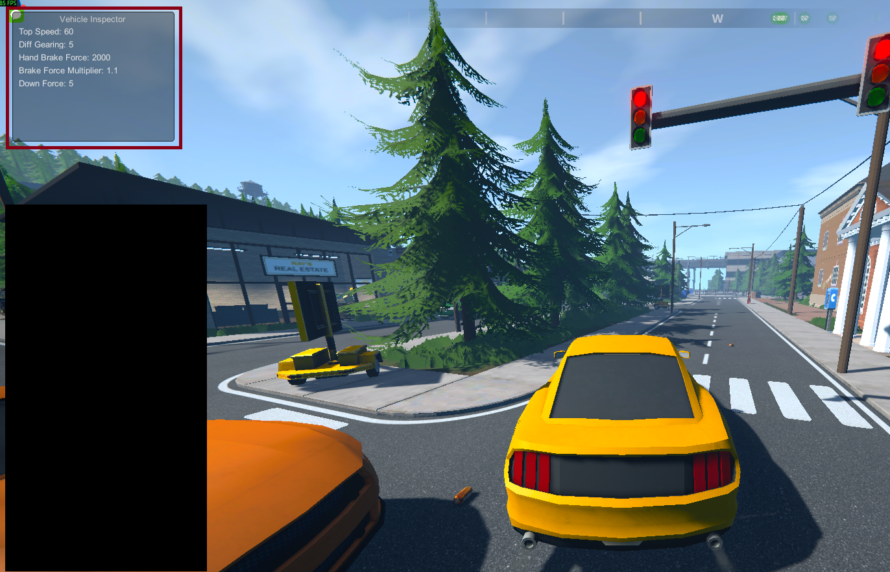

# Schedule 1 Vehicle Mod

> ⚠️ **Work in Progress** — This mod is being developed purely for fun. Use it at your own risk. Expect bugs, breaking changes, and general chaos.

A MelonLoader mod for Schedule 1 that displays detailed vehicle statistics for the car the player is currently in.

## Current Features

- In-game GUI window showing real-time vehicle stats for your current vehicle:
  - Top Speed
  - Diff Gearing
  - Hand Brake Force
  - Brake Force Multiplier
  - Down Force

## Preview

(preview2.png)

## Future Plans

- Ability to modify vehicle stats on the fly in-game
- A full vehicle upgrade system (long-term goal)

## Requirements

- [MelonLoader](https://github.com/LavaGang/MelonLoader)
- Schedule 1 (Steam)

## Installation

1. Install MelonLoader for Schedule 1
2. Drop the compiled `.dll` into your `Mods/` folder
3. Launch the game

## Notes

DLL references are sourced from your local Schedule 1 / MelonLoader installation and are not included in this repository.
